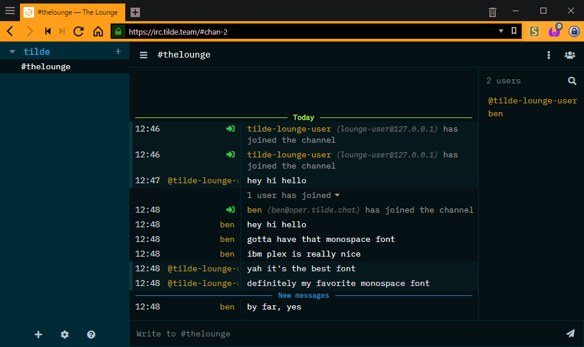

<h1 align="center">
	Solarized theme for The Lounge
</h1>

<h3 align="center">
	An opinionated simple theme with Solarized colours
</h3>

benharri's fork with some small tweaks that i've collected

some of the tweaks include:

* compact chanlist
* compact userlist (hides roles/modes)
* [ibm plex mono](https://github.com/ibm/plex)


<p align="center">
	<a href="https://yarn.pm/thelounge-theme-solarized-fork-monospace"></a>
	<a href="https://npm-stat.com/charts.html?package=thelounge-theme-solarized-fork-monospace&from=2016-02-12"></a>
</p>

<p align="center">
	
</p>


## Installation

Install this theme with:

```sh
thelounge install thelounge-theme-solarized-fork-monospace
```
